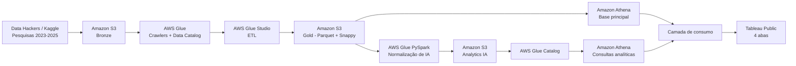

# Tech Challenge — Fase 3

Pipeline de dados em AWS para consolidação e análise das pesquisas **State of Data Brasil / Data Hackers** de 2023, 2024 e 2025.

O projeto integra três edições da pesquisa, padroniza os schemas, trata duplicidades, normaliza respostas multivaloradas relacionadas ao uso de Inteligência Artificial e disponibiliza os dados para análise no Amazon Athena e visualização no Tableau Public.

## Visão geral



## Objetivo

Construir um pipeline de engenharia de dados capaz de:

- consolidar as pesquisas de 2023, 2024 e 2025;
- padronizar campos com diferenças de nome e posição entre os anos;
- armazenar a camada tratada em **Parquet com compressão Snappy**;
- remover duplicidades antes do consumo;
- normalizar perguntas de múltipla escolha relacionadas à adoção de IA;
- disponibilizar bases analíticas consultáveis via **Amazon Athena**;
- suportar um dashboard final no **Tableau Public**.

## Tecnologias utilizadas

- Amazon S3
- AWS Glue Studio
- AWS Glue Crawlers
- AWS Glue Data Catalog
- PySpark
- Amazon Athena
- SQL
- Tableau Public
- draw.io / diagrams.net

## Pipeline

### 1. Camada Bronze

Os arquivos CSV originais das três pesquisas são armazenados em:

```text
s3://dados-fase3/bronze/
```

Os schemas são descobertos por crawlers e registrados no Glue Data Catalog, no database `tech_challenge`.

### 2. ETL e camada Gold

O job principal do AWS Glue Studio realiza seleção de campos, padronização de schema e união das três pesquisas.

A base consolidada é armazenada em:

```text
s3://dados-fase3/gold/pesquisa_data_hackers/
```

Formato de saída:

```text
Parquet + Snappy
```

A camada contém **14 campos padronizados** e **14.005 registros brutos** antes da deduplicação.

### 3. Qualidade e deduplicação

Na camada de consumo, a remoção de registros duplicados reduz a base para:

**14.002 respondentes únicos**.

Os principais campos consolidados são:

```text
respondente_id
idade
genero
estado
uf
regiao
cargo_atual
nivel
faixa_salarial
tempo_experiencia_dados
modelo_trabalho_atual
tipo_uso_ia_empresa
uso_ia_generativa
ano_pesquisa
```

### 4. Normalização de Inteligência Artificial

O job PySpark [`tech_challenge_normalizacao_ia`](glue/normalizacao_ia.py) trata as perguntas multivaloradas de IA.

O processamento inclui:

- `dropDuplicates()`;
- classificação baseada em **regras textuais determinísticas**;
- criação de arrays de categorias;
- filtragem de valores nulos;
- `explode` para transformar múltiplas seleções em associações individuais;
- deduplicação final.

#### Uso de IA generativa

Categorias finais:

- Gratuita
- Paga pelo próprio usuário
- Paga pela empresa
- IA para código / Copilot
- Não utiliza

Resultado final: **11.159 associações**.

#### Uso de IA nas empresas

Categorias finais:

- Uso individual / descentralizado
- Direcionamento corporativo
- IA para desenvolvimento
- Produtos / clientes
- Processos internos / produtividade
- Baixa maturidade / casos isolados
- IA como frente principal do negócio
- Não sabe opinar

Resultado final: **16.120 associações**.

As duas normalizações alcançaram **100% de cobertura das respostas não vazias**.

### 5. Amazon Athena

O Athena é utilizado para validação e preparação das bases de consumo.

As tabelas principais são:

```text
tech_challenge.pesquisa_data_hackers
tech_challenge.uso_ia_generativa
tech_challenge.uso_ia_empresa
```

As tabelas de IA são enriquecidas separadamente com as dimensões da base principal. Essa decisão evita multiplicação cartesiana quando um mesmo respondente possui múltiplas categorias nas duas perguntas de IA.

As consultas utilizadas na validação e na preparação das bases estão disponíveis em [`sql/validacao_base.sql`](sql/validacao_base.sql) e [`sql/consumo_tableau.sql`](sql/consumo_tableau.sql).

## Dashboard

O resultado analítico é apresentado em um dashboard no Tableau Public com quatro abas:

1. **Perfil** — distribuição geográfica, idade, gênero e senioridade;
2. **Remuneração** — faixa salarial por senioridade e experiência;
3. **Modelo de Trabalho** — evolução entre remoto, híbrido e presencial;
4. **Adoção de IA** — evolução do uso de IA generativa e adoção empresarial.

Dashboard: [Panorama do Mercado de Dados no Brasil](https://public.tableau.com/app/profile/rodrigo.ribeiro4866/viz/fase_3_tech_challenge/apresentacao)

## Principais insights

A análise das amostras anuais evidencia alguns movimentos relevantes entre 2023 e 2025:

- **IA generativa:** entre os respondentes das questões de IA, a participação do uso de soluções gratuitas caiu de **58,7% em 2023 para 23,2% em 2025**, enquanto soluções **pagas pela empresa chegaram a 32,1%** em 2025.
- **Adoção empresarial de IA:** a distribuição das respostas sugere maior estruturação corporativa. A categoria **Direcionamento corporativo** passou de **7,1% em 2023 para 18,1% em 2025**, enquanto **Uso individual / descentralizado** caiu de **31,1% para 24,4%**.
- **Modelo de trabalho:** a participação do modelo **100% remoto** caiu de **46,3% em 2023 para 39,7% em 2025**, enquanto o **100% presencial** passou de **16,6% para 20,8%**.
- **Remuneração:** a distribuição salarial apresenta progressão clara conforme aumentam a senioridade e o tempo de experiência, com maior concentração dos profissionais mais experientes nas faixas salariais superiores.

Esses resultados descrevem mudanças na distribuição das respostas das amostras de cada edição e não devem ser interpretados como acompanhamento longitudinal dos mesmos indivíduos.

## Principais números

| Indicador | Resultado |
|---|---:|
| Anos consolidados | 3 |
| Registros brutos na camada Gold | 14.005 |
| Respondentes após deduplicação | 14.002 |
| Associações de IA generativa | 11.159 |
| Associações de uso de IA nas empresas | 16.120 |
| Abas do dashboard | 4 |

## Artefatos técnicos

- [Job PySpark de normalização de IA](glue/normalizacao_ia.py)
- [SQL de validação da base principal](sql/validacao_base.sql)
- [SQL das bases analíticas para o Tableau](sql/consumo_tableau.sql)
- [Documentação detalhada do pipeline](docs/pipeline.md)
- [Arquitetura editável em draw.io](architecture/arquitetura.drawio)

## Estrutura do repositório

```text
tech-challenge-fase-3/
├── README.md
├── .gitignore
├── architecture/
│   └── arquitetura.drawio
├── glue/
│   └── normalizacao_ia.py
├── sql/
│   ├── validacao_base.sql
│   └── consumo_tableau.sql
└── docs/
    └── pipeline.md
```

## Considerações metodológicas

As pesquisas de 2023, 2024 e 2025 representam amostras diferentes. Portanto, comparações entre os anos indicam mudanças na distribuição das respostas, e não o acompanhamento longitudinal dos mesmos indivíduos.

Nas perguntas de IA, um respondente pode selecionar mais de uma alternativa. Por isso, as tabelas normalizadas representam **associações entre respondentes e categorias**, e não contagens de indivíduos únicos.

## Dados

Os datasets originais não são versionados neste repositório. Eles são provenientes das pesquisas públicas State of Data Brasil / Data Hackers e foram utilizados somente como fonte para o pipeline.

## Autor

Projeto desenvolvido como entrega do **Tech Challenge — Fase 3**.
